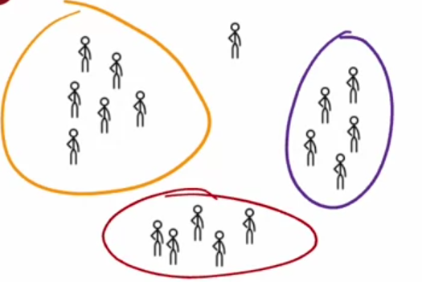
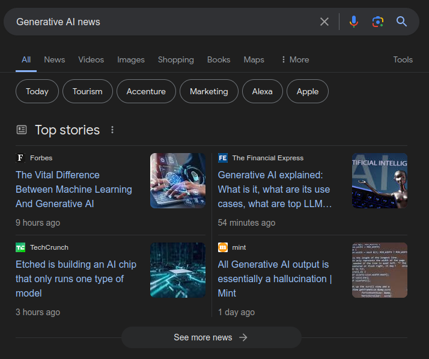

# Week 1 - Unsupervised Learning

**Learning Objectives**

- Implement the k-means clustering algorithm
- Implement the k-means optimization objective
- Initialize the k-means algorithm
- Choose the number of clusters for the k-means algorithm
- Implement an anomaly detection system
- Decide when to use supervised learning vs. anomaly detection
- Implement the centroid update function in k-means
- Implement the function that finds the closest centroids to each point in k-means

---

## Ch 1: Clustering

### What is Clustering?

> A clustering algorithm looks at a number of data points and automatically finds data points that are related or similar to each other. ~ _Andrew Ng_

**Clustering** is an **Unsupervised Learning** algortihm that groups similar data points together. It is used to find patterns in data and group similar data points together.

### Difference in Supervised and Unsupervised Learning
| Basis | Supervised Learning | Unsupervised Learning |
|:-----:|:-------------------:|:---------------------:|
| **Data**  | Labeled - $(x, y)$          | Unlabeled - $x$            |
| **Training set** | $(x^{(1)}, y^{(1)}), (x^{(2)}, y^{(2)}), \ldots, (x^{(m)}, y^{(m)})$ | $x^{(1)}, x^{(2)}, \ldots, x^{(m)}$ |
| **Goal**  | Predict the label $y$            | Understand the patterns in data and group similar data points together |
| **Example** | **Regression**: House Price Prediction <b> **Classification**: Spam Email Classification |  Grouping similar YT videos together |
| **Visual Difference** |   |  |

### Applications of Clustering

#### Market Segmentation
- Grouping customers based on certain criteria like income, interests etc...
- Helps in understanding the customer better and target them with specific marketing strategies accordingly.

#### Grouping Similar News Articles
- Grouping similar documents together based on the content of the document.
- Helps in organizing and recommending similar articles to the user.

#### DNA Analysis
- Analyzing DNA sequences and grouping similar sequences together.
- Like grouping people who exhibit similar genetic traits.

#### Astronomical Analysis
- Grouping similar bodies together for analyzing which ones forms galaxy or a coherent structures in space.

---

